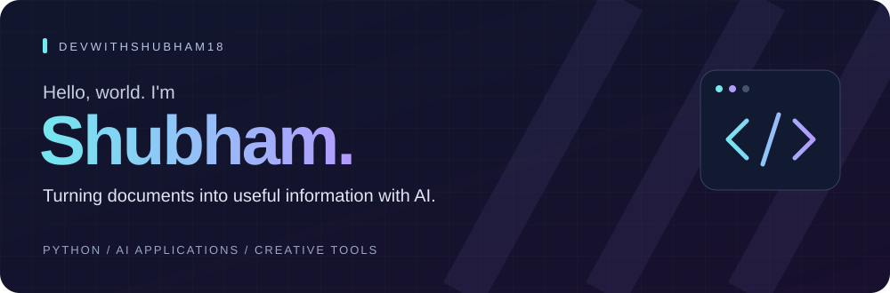
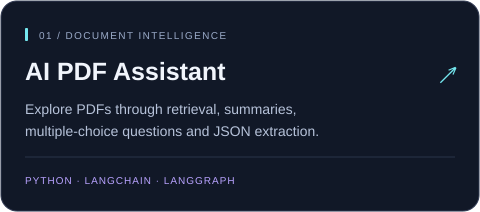
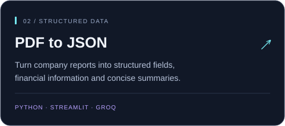
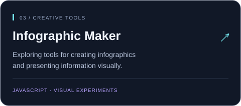
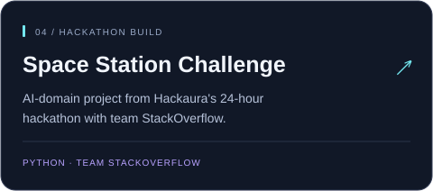

  

  
  

## 👋 A little about me

I'm **Shubham**, a developer exploring how AI can make information easier to work with. I build with **Python**, connecting language models, document processing, and interactive interfaces.

My projects range from **AI assistants for PDFs** and **structured data extraction** to experiments with **illustrations and infographics**. I also built an AI-domain project with **team StackOverflow** at Hackaura's 24-hour hackathon.

- 🧠 **Exploring:** AI agents, document retrieval, and workflows with language models.
- 📄 **Building:** Tools that turn PDFs into summaries, questions, and structured data.
- 🎨 **Experimenting:** Creative tools for visual content and infographics.

## 🛠️ Tools I build with

  
  
  
  
  
  
  
  
  

## 🚀 Featured projects

  <a href="https://github.com/DevWithShubham18?tab=repositories"><strong>See all my repositories →</strong></a>

---

  <strong>Thanks for stopping by.</strong> 
  Take a look around — each repository is another idea I'm exploring.

